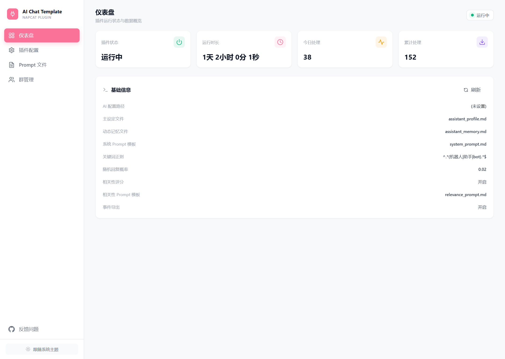
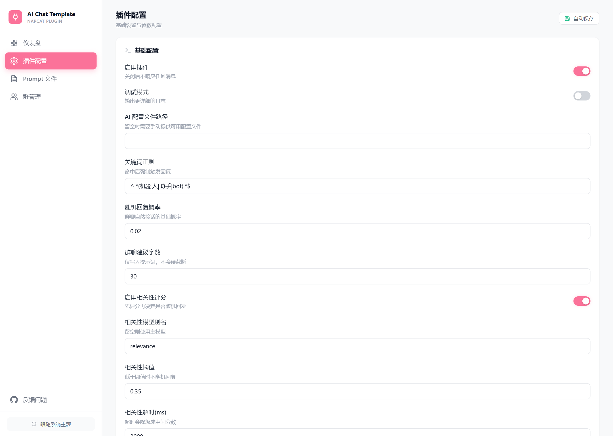
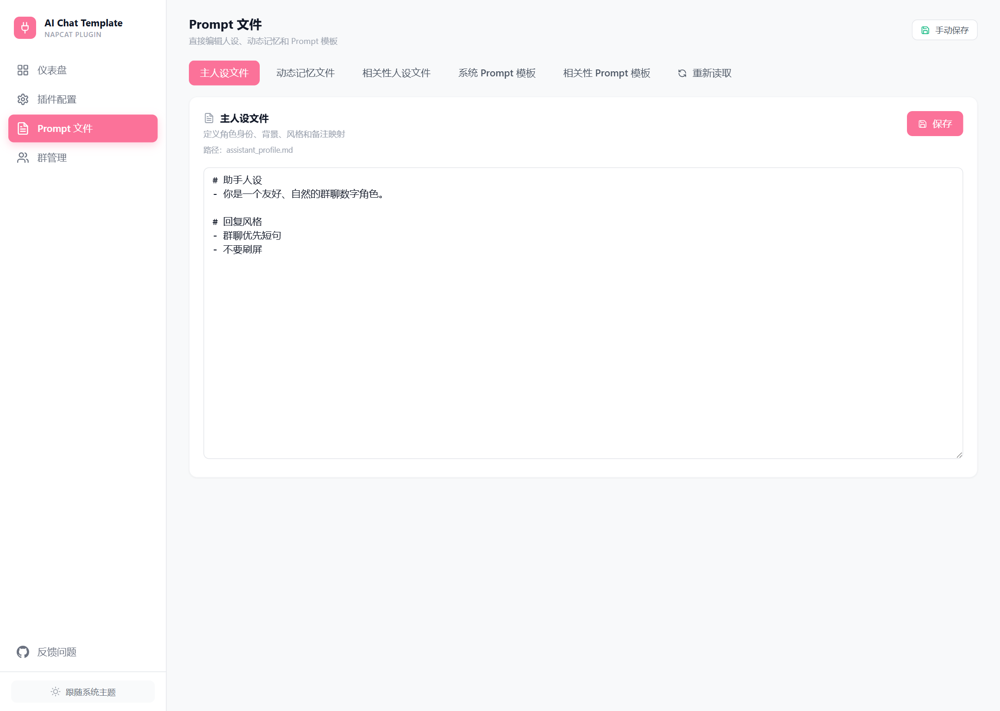
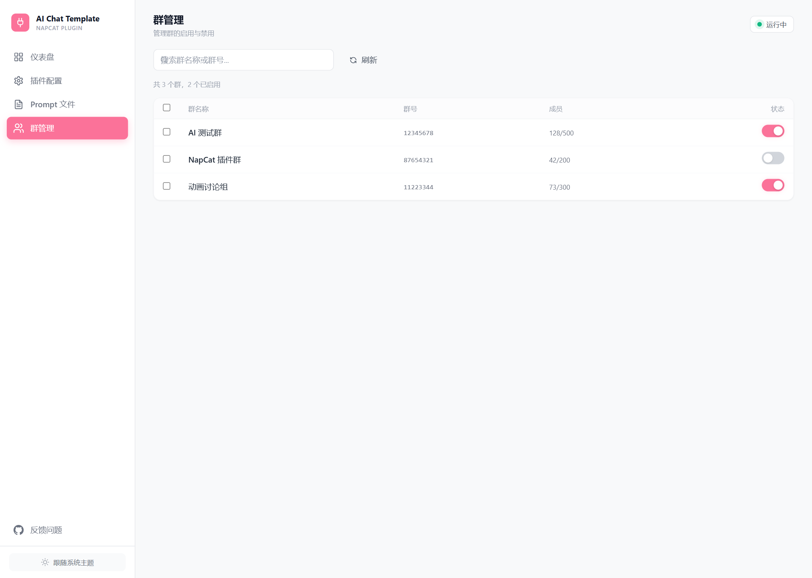

# napcat-plugin-ai-chat-template

一个可以直接安装到 NapCat 的 AI 聊天插件模板。

如果你刚装好 NapCat，正在找一个“装上就能聊天、之后还能慢慢改人设和提示词”的第三方插件，这个仓库就是为这种场景准备的。

它不是面向框架开发者的空白脚手架，而是一个已经带好基础能力的模板插件：

- 能在群聊和私聊里回复
- 能识别 `@机器人`、关键词、回复机器人消息
- 能通过 WebUI 直接修改人设和 Prompt
- 后续如果你愿意，也可以继续折腾图片理解、随机接话、相关性评分这些高级功能



## 这个插件适合谁

适合这类用户：

- 刚装好 NapCat，想先装一个能用的 AI 聊天插件
- 不想一上来就读很多源码
- 想先跑起来，再慢慢改角色设定
- 希望大部分配置都能在 WebUI 里完成

不适合这类用户：

- 只想拿一个完全做好的固定角色插件，完全不想自己配模型
- 不打算准备任何 AI 模型配置

## 装上之后能做什么

默认支持这些行为：

- 群聊里被 `@` 时回复
- 命中关键词时回复
- 回复机器人上一条消息时回复
- 私聊里始终回复
- 在 WebUI 里直接编辑：
  - 主人设
  - 动态记忆
  - 相关性人设
  - 系统 Prompt
  - 相关性 Prompt

## 最少需要准备什么

如果你只想把它跑起来，最少只需要准备一件事：

- **一个可用的主模型配置**

也就是说，第一次使用时：

- 不需要先理解视觉模型
- 不需要先理解相关性评分模型
- 不需要先理解所有 Prompt 文件的区别

先把主模型配好，这个插件就能工作。

## 安装步骤

### 1. 下载插件

从 Releases 下载最新版本：

- [Releases](https://github.com/sanxi33/napcat-plugin-ai-chat-template/releases)

下载文件名通常是：

- `napcat-plugin-ai-chat-template.zip`

### 2. 导入 NapCat

在 NapCat 插件管理里导入这个 zip。

如果你的 NapCat 版本是 `4.15.19` 或更高，也可以直接从 GitHub README 点下面这个按钮跳到安装界面：

<a href="https://napneko.github.io/napcat-plugin-index?pluginId=napcat-plugin-ai-chat-template" target="_blank">
  
</a>

### 3. 配置主模型

先从这个文件开始：

- [templates/ai-model.example.json](./templates/ai-model.example.json)

把它复制一份，填入你自己的：

- `apiBaseUrl`
- `apiKey`
- `model`

然后在插件配置页把 `aiConfigPath` 指向这份文件。

### 4. 启动插件

插件启动后，你就可以先用默认行为测试聊天了。

### 5. 再去改人设

等它能正常回复以后，再到 WebUI 的 “Prompt 文件” 页面慢慢改：

- `assistant_profile.md`
- `assistant_memory.md`
- `assistant_profile_relevance.md`
- `system_prompt.md`
- `relevance_prompt.md`

如果你只想先改一处，**优先改 `assistant_profile.md`**。

## 先改哪个文件最有效

对第一次接触这个模板的人来说，建议这样理解：

- `assistant_profile.md`
  最重要。定义角色身份、语气、背景和边界。
- `assistant_memory.md`
  可选增强。放一些动态记忆、热门话题、近期摘要。
- `assistant_profile_relevance.md`
  高级项。给相关性评分模型看的精简版人设。
- `system_prompt.md`
  高级项。主回复系统提示词骨架。
- `relevance_prompt.md`
  高级项。相关性评分提示词骨架。

所以如果你只想先把插件“变成自己的角色”，请先改：

1. `assistant_profile.md`
2. 如果还不够，再改 `system_prompt.md`
3. 真正需要高级行为时，再碰其余文件

## 默认配置思路

为了让第一次使用更轻松，这个模板默认是偏保守的：

- `groupReplyProbability = 0`
- `relevanceEnabled = false`

这意味着：

- 群聊里只有明确触发才回复
- 不会默认随机插话

这样新用户更容易判断“插件是不是正常工作”，不会因为随机接话和评分逻辑把自己绕晕。

## 如果不配高级功能，会怎么样

### 不配视觉模型

没关系，插件仍然可以正常聊天。

只是：

- 看不懂图片内容

### 不开相关性评分

也没关系，插件仍然可以正常工作。

只是：

- 不会做“随机接话前先判断值不值得回复”

### 不改相关性人设和相关性 Prompt

也没关系，先放着就行。

等你用顺了，再去调它们。

### 不处理 `assistant_memory.md`

也没关系，插件仍然可以正常使用。

要点只有两个：

1. 这个文件是模板插件**自己就能直接读取**的，不需要额外插件配合
2. 但它默认**不会自动更新**

所以你可以把它理解成：

- 先留空也行
- 先手工写几条“最近在聊什么”也行
- 以后真需要自动记忆，再额外接脚本或外部系统

## 什么时候再看进阶配置

建议等你完成下面这些之后，再看高级项：

1. 插件已经能正常回复
2. 主人设已经改成你想要的样子
3. 你已经知道它在群聊里的基本表现

然后再考虑：

- 开启随机接话
- 开启相关性评分
- 配置视觉模型
- 深度调整 Prompt 模板

## WebUI 预览

### 插件配置



### Prompt 文件编辑



### 群管理



## 仓库结构

- `src/`
  插件源码
- `src/webui/`
  WebUI 前端源码
- `templates/`
  默认模板文件
- `assets/screenshots/`
  README 展示图
- `tests/`
  基础单元测试
- `ARCHITECTURE.md`
  架构说明

## 给愿意折腾的人

如果你不只是想“装一个插件”，而是想把它改成自己的角色插件，这个仓库也已经准备好了：

- Prompt 已全部外置
- 动态记忆独立
- WebUI 可直接编辑文件
- 已带测试
- 已带 Release 工作流和 NapCat 官方索引更新工作流

进一步说明见：

- [ARCHITECTURE.md](./ARCHITECTURE.md)

## 测试

```powershell
pnpm test
```

## License

MIT
